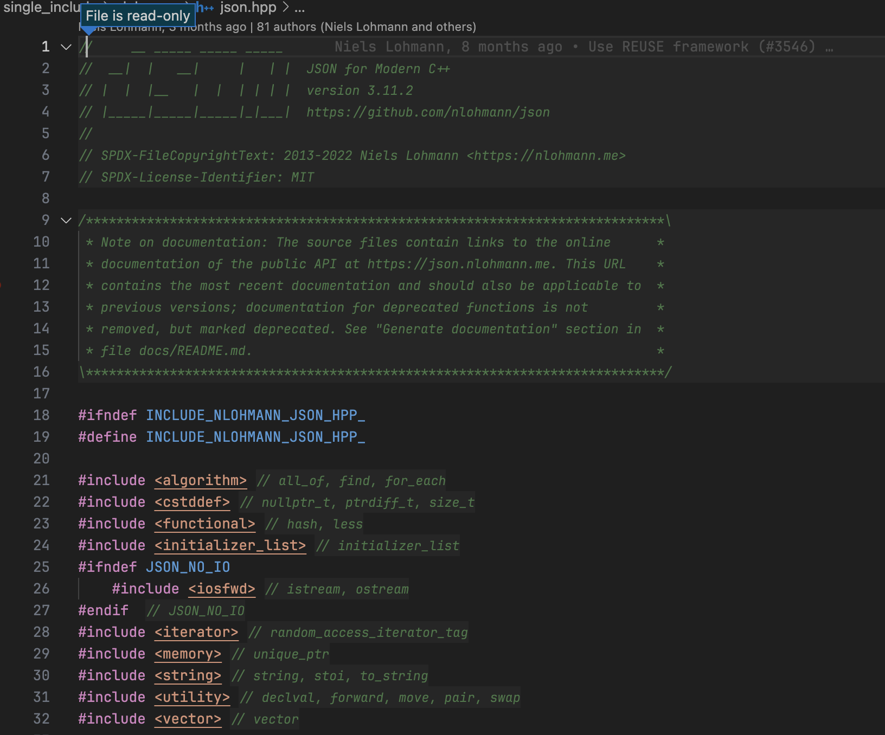

# Reader Mode

Provides an elegant and secure way to read library code.

> The goal of this extension is to bring the feature of IntelliJ reader mode into Visual Studio Code as much as possible.



## Features

- Mark files as read-only, so you can't accidentally edit them.
- Highlight comments in a soft color, this makes it easier to distinguish between comments and code.
- Automatically open files in reader mode, out of workspace or by glob matching.

## Usage

Toggle reader mode for current file:

- Open the command palette and run `Reader Mode: Toggle Reader Mode for Current File`.

  > Manually switching the files that match the auto reader mode rules from reader mode to normal will disable the auto reader mode for these files until you reload window, or you can manually toggle them back to reader mode.

Toggle reader mode for current workspace:

- Open the command palette and run `Reader Mode: Toggle Reader Mode for Current Workspace`.

Automatically open files in reader mode:

- See [Settings](#settings).

## Settings

Enable reader mode automatically for files out of the current workspace:

```json
"reader-mode.auto.outOfWorkspace": true
```

Enable reader mode automatically for files matching glob:

```json
"reader-mode.auto.glob": [
  "**/node_modules/**"
]
```

Change the comment style in reader mode, you should use the string form of valid CSS values here:

```jsonc
// "reader-mode.commentStyle.fontFamily":  "Consolas, 'Courier New', monospace",
"reader-mode.commentStyle.fontStyle": "italic",
"reader-mode.commentStyle.fontSize": "0.9em",
"reader-mode.commentStyle.fontWeight": "300",
"reader-mode.commentStyle.opacity": "0.7",
"reader-mode.commentStyle.backgroundColor": "rgba(255, 255, 255, 0.03)"
```

## How It Works

This extension registers a `reader-mode` file scheme, and redirects file content and most of the language features to this scheme. Hijacking files open from explorer or toggling read-only mode is just closing the original editor and opening a `reader-mode` one.

## Known Issues

- Flickering when toggling files, which is because the extension API doesn't provide a way to hijack files open.
- Evaluatable Expression in debug session doesn't work, which is because the extension API doesn't provide a way to request expression values.

## Contributing

If you have any ideas or suggestions, please feel free to open an issue or pull request.
