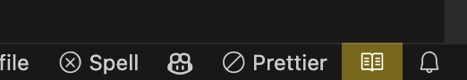

# Reader Mode

Provides an elegant and secure way to read library code.

> The goal of this extension is to bring the feature of IntelliJ reader mode into Visual Studio Code as much as possible.


## Features

- Mark files as read-only, so you can't accidentally edit them.
- Highlight comments in a soft color, this makes it easier to distinguish between comments and code.
- Automatically open files in reader mode, out of workspace or by glob matching.

## Usage

Temporarily Toggle reader mode for current file:

- Find the book icon in the right bottom corner of the status bar and click it.
  
- Open the command palette and run `Reader Mode: Toggle Reader Mode for Current File`.

Toggle reader mode for current workspace:

- Open the command palette and run `Reader Mode: Toggle Reader Mode for Current Workspace`.

Automatically open files in reader mode:

- See [Settings](#settings).

## Settings

Enable reader mode automatically for files out of the current workspace:

```json
"reader-mode.auto.outOfWorkspace": true
```

Enable reader mode automatically for files matching glob:

```json
"reader-mode.auto.glob": [
  "**/node_modules/**"
]
```

Exclude files from enabling reader mode automatically:

```json
"reader-mode.auto.exclude": [
  "**/.vscode/settings.json"
]
```

Change the comment style in reader mode, you should use the string form of valid CSS values here:

```jsonc
"reader-mode.commentStyle.fontFamily":  "Consolas, 'Courier New', monospace",
"reader-mode.commentStyle.fontStyle": "italic",
"reader-mode.commentStyle.fontSize": "0.9em",
"reader-mode.commentStyle.fontWeight": "300",
"reader-mode.commentStyle.opacity": "0.7",
"reader-mode.commentStyle.backgroundColor": "rgba(255, 255, 255, 0.03)"
```

## How It Works

This version is a new implementation of the extension, which is not hijacking files but just listening to document changes, and simply undoing them.

## Contributing

If you have any ideas or suggestions, please feel free to open an issue or pull request.
